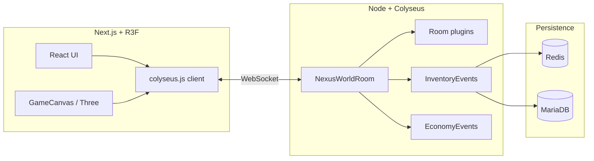

# Architecture / Arquitectura

## Vista general / Overview

## Sala y plugins / Room & plugins

`NexusWorldRoom` compone subsistemas. El primer plugin registrado vía API es **`core:world-resource-nodes`** (`server/room/nexusRoomPlugins.ts` + `createWorldResourceNodesPlugin`). Otros módulos (`TreeChopEvents`, `HousingEvents`, …) se migrarán al mismo patrón de forma incremental.

## Protocolo / Protocol

`@nexusworld3d/protocol` exporta:

- `PROTOCOL_VERSION` — subir cuando haya cambios incompatibles en payloads **core** (pendiente: handshake estricto).
- `WorldMessages`, `HousingMessages`, `InventoryMessages`, `PlayerMessages`, etc.

Usa estos enums en **cliente y servidor** para que renombrar un mensaje sea un solo cambio.
